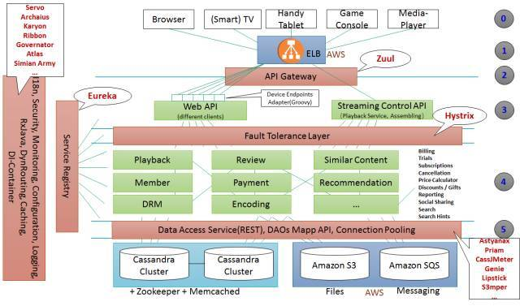

## 引言

微服务是一个个独立的服务单元，每个微服务具备独立的水平扩展功能，通过水平扩展能获取更多的CPU和内存资源，微服务也能纵向扩展，支持更多分片，通过微服务的组合，能够构建出一个易于维护的大系统。

本文会从一些大公司的微服务框架入手，教大家如何去搭建一个微服务。

## 先从Netflix的框架入手

Netflix是微服务架构的先驱，本系列文章从网上流传的Netflix架构图开始拆解微服务架构的技术细节

本系列讲拆分讲解这个架构的各个单元，

* [负载均衡ELB](./all/负载均衡ELB.md)
* [网关Gateway](./all/网关设计GATEWAY.md)
* [熔断Hystrix](./all/熔断Hystrix.md)
* [服务注册与发现](./all/服务注册与发现.md)
* [数据存储](./all/数据存储.md)

以及架构中没有提到，但是微服务架构一定会涉及的
* [配置中心](./all/配置中心.md)
* [微服务管理](./all/微服务管理.md)
* （todo）日志用 ElasticSearch
* （todo）链路监控
* （todo）各种猴子（Chaos/Latency/Janitor/SecurityMonkey 等）

每个单元的功能简介，用JAVA如何实现他的使用，适合初学者和有使用需求的人。
部分框架会解读源码，适合进阶的者学习。

[本文示例源码](https://github.com/WayneZeng/springcloud-demo)

## 如有问题可以联系作者

本文力图讲解的简单，从易到难，不会给大家带来 添加画马的细节就变成八骏图的跳跃感（读网上很多教程都有这种感觉）
如果你没有看懂，是我的问题，请反馈给我你没看懂的地方，我力图给你讲得更清楚一些。

* email： zengweisap@163.com（推荐）
* wechat：WayneSummer（注明缘由，否则不通过）

* 如有侵权，请联系本人删除
* 如有错漏，请批评指正
* 如果转载，请注明出处
* 如有打赏，请不要客气

【支付宝扫码领红包】奖励自己一下，后面还有。

