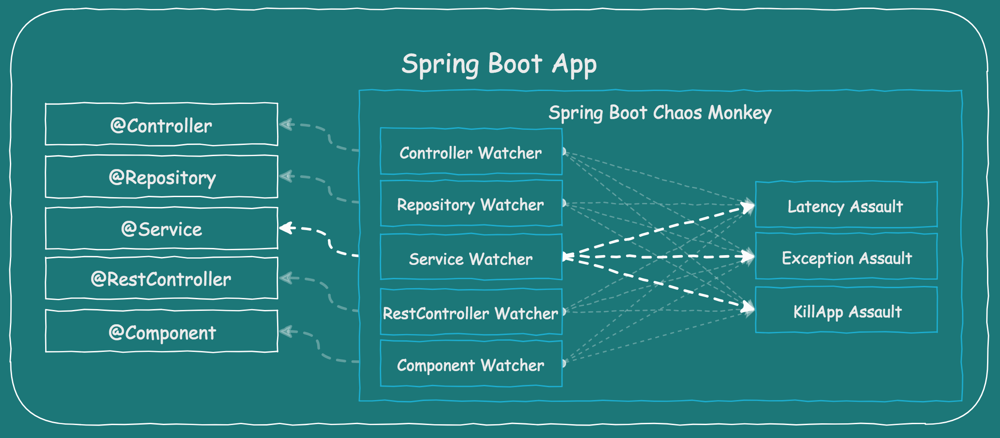
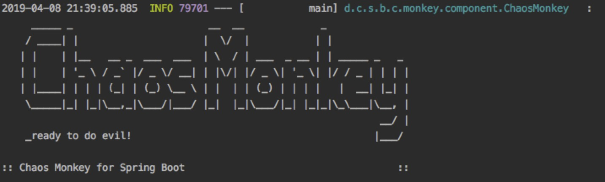

### 话不多说前言

* Netflix的猴子家族统称[Simian Army](https://github.com/Netflix/SimianArmy)
* 用于测试服务器的健壮性，故障演练和自动运维

### Simian Army包含以下几种Monkey
* Chaos Monkey，随机关闭实例，用于故障演练
* Conformity Monkey，查找不符合最佳实践的实例，并将其关闭
* Janitor Monkey，查找不再需要的资源，将其回收

### 书中自有黄金屋

- 客官,你看完了前言,如此优秀
- 【支付宝扫码】奖励自己一下，后面还有。


### Chaos Monkey介绍

* [开源项目](https://github.com/Netflix/chaosmonkey)

* 什么是Chaos Monkey？

    -   能随机终止系统中的部分服务，可以设定停止的时间和间隔
    -   通常在工作时间模拟，方便出现问题有人解决
    -   为了减少半夜突然加班，就在平时多跑跑Chaos Monkey吧
    -   请不要在发布环境运行，自己搭建测试平台吧
    
### chaos-monkey-spring-boot

* [开源项目](https://github.com/codecentric/chaos-monkey-spring-boot)

* 专门为Spring Boot打造的Chaos Monkey

* 工作原理

    - 自动扫描应用中的以下类注解

```
@Controller
@RestController
@Service
@Repository
@Component
```

    - 通过配置激活assaults和watcher
    
   

* 可配置assaults有三种类型

    - Latency Assault
    - Exception Assault
    - AppKiller Assault


### 依赖


```
<dependency>
    <groupId>de.codecentric</groupId>
    <artifactId>chaos-monkey-spring-boot</artifactId>
    <version>2.0.1</version>
</dependency>
```

### 启动

* 通过命令启动
```
java -jar your-app.jar --spring.profiles.active=chaos-monkey
```

* 通过配置(application.properties)启动

```
spring.profiles.active=chaos-monkey
chaos.monkey.enabled=true
```

* 通过配置启动的全部配置示例

```
server.port=10011
spring.application.name=chaos

spring.profiles.active=chaos-monkey
chaos.monkey.enabled=true

chaos.monkey.watcher.controller=false
chaos.monkey.watcher.restController=true
chaos.monkey.watcher.service=true
chaos.monkey.watcher.repository=false
```


*   下图说明启动成功

    

* Chaos Monkey会随机攻击 @Service类，也会在public方法中添加响应延迟。

### 进阶功能（通过Http构建）

* 配置

```
management.endpoint.chaosmonkey.enabled=true
management.endpoint.chaosmonkeyjmx.enabled=true

# inlcude all endpoints
management.endpoints.web.exposure.include=*

# include specific endpoints
management.endpoints.web.exposure.include=health,info,chaosmonkey
```

* 功能说明


ID | 描述 | 方法
---|---|---
/chaosmonkey | 运行chaos monkey | GET
/chaosmonkey/status | chaos monkey是 enable or disabled | GET
/chaosmonkey/enable | enable | POST
/chaosmonkey/disable| disable | POST
/chaosmonkey/watcher | 启动watcher| GET
/chaosmonkey/assaults | 启动 assults | GET
/chaosmonkey/assaults | 更新 assults | POST

* 运行举例：/chaosmonkey


```
{
    "chaosMonkeyProperties":{
        "enabled":true
    },
    "assaultProperties":{
        "level":3,
        "latencyRangeStart":1000,
        "latencyRangeEnd":3000,
        "latencyActive":true,
        "exceptionsActive":false,
        "killApplicationActive":false,
        "watchedCustomServices":[

        ]
    },
    "watcherProperties":{
        "controller":true,
        "restController":false,
        "service":true,
        "repository":false,
        "component":false
    }
}
```

### 源码分析

* 找到chaos的工程，，找到下面一段内容

位置在META-INF/spring.factories

```
org.springframework.boot.autoconfigure.EnableAutoConfiguration=\
  de.codecentric.spring.boot.chaos.monkey.configuration.ChaosMonkeyConfiguration
```

    可以看出是通过EnableAutoConfigurationImportSelector读取，被springboot自动加载的
    
* 看到chaos的源码工程大致分为以下几个区域

    - component 实现类
    - conditions 控制类
    - configuration 配置类
    - endpoints
    - watcher 切面的实现
    
* 打开EnableConfigurationProperties

```
@EnableConfigurationProperties({ChaosMonkeyProperties.class, AssaultProperties.class, WatcherProperties.class})

```

    -   其中加载了一些默认配置，通过修改application.properties可以将其覆盖

    -   然后在其中分别根据condition的配置加载了watcher
    
```
@Bean
    public ChaosMonkey chaosMonkey(List<ChaosMonkeyAssault> chaosMonkeyAssaults) {
        return new ChaosMonkey(settings(), chaosMonkeyAssaults, publisher());
    }
```

    - 从ChaosMonkey跳转到实现的component
    
* ChaosMonkey的实现

    - callChaosMonkey 被各个切面调用，策略模式的执行方法
    
    - chooseAndRunAttack
    执行Attack
    
    
这一篇就到这里了， [本文示例源码github](https://github.com/WayneZeng/springcloud-demo)

喜欢请打赏5毛买包狗粮


    


    

    


 


    


