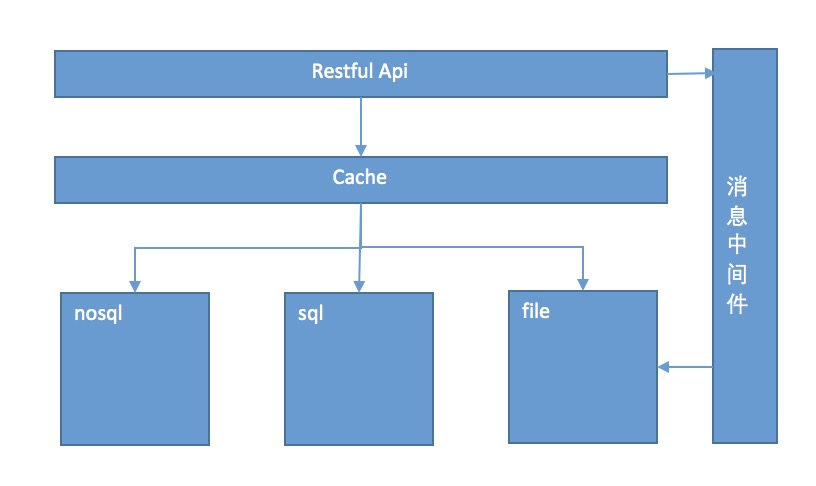

### 话不多说前言

- Netflix微服务架构图没有细说数据存储架构，我这里根据理解给出了更通用的架构并讲解
- 

### 模块拆分

* restful api提供调用入口（http接口），可替代方案是dubbo接口调用（rpc调用）
* 第二层缓存，数据存取尽可能先命中缓存，netflix用的Memcache，也有其他方案
* 第三层持久层，nosql，sql，文件系统分别用于存非结构数据，结构数据，文件
* 消息中间件，用于处理异步任务

### 三级缓存架构（todo）

[推荐阅读](https://www.cnblogs.com/panchanggui/p/9503666.html)

### 数据库连接池化技术

[推荐阅读](https://github.com/alibaba/druid/tree/master/druid-spring-boot-starter)
* 为了优化性能，减少连接创建和销毁开销，会用到池化技术，常用的是druid数据库连接池

* 使用比较简单，导入依赖
```java
<dependency>
   <groupId>com.alibaba</groupId>
   <artifactId>druid-spring-boot-starter</artifactId>
   <version>1.1.10</version>
</dependency>
```

* 直接用配置的方式即可
```java
spring.datasource.druid.initial-size=
spring.datasource.druid.max-active=
spring.datasource.druid.min-idle=
spring.datasource.druid.max-wait=
spring.datasource.druid.pool-prepared-statements=
spring.datasource.druid.max-pool-prepared-statement-per-connection-size= 
spring.datasource.druid.max-open-prepared-statements= #和上面的等价
spring.datasource.druid.validation-query=
spring.datasource.druid.validation-query-timeout=
spring.datasource.druid.test-on-borrow=
spring.datasource.druid.test-on-return=
spring.datasource.druid.test-while-idle=
spring.datasource.druid.time-between-eviction-runs-millis=
spring.datasource.druid.min-evictable-idle-time-millis=
spring.datasource.druid.max-evictable-idle-time-millis=
spring.datasource.druid.filters= #配置多个英文逗号分隔
```

* 监控涉及配置如下
```java
# WebStatFilter配置，说明请参考Druid Wiki，配置_配置WebStatFilter
spring.datasource.druid.web-stat-filter.enabled= #是否启用StatFilter默认值false
spring.datasource.druid.web-stat-filter.url-pattern=
spring.datasource.druid.web-stat-filter.exclusions=
spring.datasource.druid.web-stat-filter.session-stat-enable=
spring.datasource.druid.web-stat-filter.session-stat-max-count=
spring.datasource.druid.web-stat-filter.principal-session-name=
spring.datasource.druid.web-stat-filter.principal-cookie-name=
spring.datasource.druid.web-stat-filter.profile-enable=

# StatViewServlet配置，说明请参考Druid Wiki，配置_StatViewServlet配置
spring.datasource.druid.stat-view-servlet.enabled= #是否启用StatViewServlet（监控页面）默认值为false（考虑到安全问题默认并未启动，如需启用建议设置密码或白名单以保障安全）
spring.datasource.druid.stat-view-servlet.url-pattern=
spring.datasource.druid.stat-view-servlet.reset-enable=
spring.datasource.druid.stat-view-servlet.login-username=
spring.datasource.druid.stat-view-servlet.login-password=
spring.datasource.druid.stat-view-servlet.allow=
spring.datasource.druid.stat-view-servlet.deny=

# Spring监控配置，说明请参考Druid Github Wiki，配置_Druid和Spring关联监控配置
spring.datasource.druid.aop-patterns= # Spring监控AOP切入点，如x.y.z.service.*,配置多个英文逗号分隔
```


