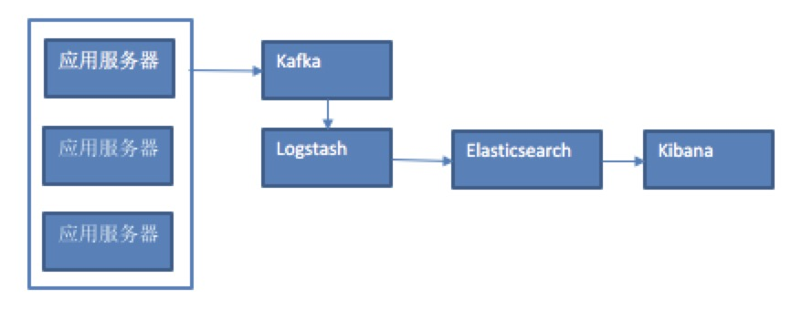

### 话不多说前言

* 网上关于Netflix的日志处理架构就一句话带过"用的[Elasticsearch](https://www.elastic.co/)"
* 本文在这个基础上引入各大公司的ELK（Logstash + Elasticsearch + Kibana）日志框架做介绍，比如： GitHub，维基百科，百度，阿里，挖财，有赞等等。


### ELK架构图



* 应用服务器产生日志
* Kafka日志处理控制消息队列
* Logstash做日志收集和解析承诺json
* Elasticsearch日志存储和索引和归纳
* Kibana日志的展示和前段界面

### 思考：大规模数据如何检索？为什么不用传统数据库做日志数据库？

从以下几个点分析：
* 如何解决单点故障
* 如何保证数据安全性，热备、冷备、异地多活
* 如何解决检索难题
* 如何解决统计分析问题(日志可以离线)


#### 对于关系型数据(mysql)： 

* 通过主从备份解决数据安全性问题； 
* 通过数据库代理中间件心跳监测，解决单点故障问题； 
* 通过代理中间件将查询语句分发到各个slave节点进行查询，并汇总结果


#### 非关系型数据库(mongo)
* 通过副本备份保证数据安全性； 
* 通过节点竞选机制解决单点问题； 
* 先从配置库检索分片信息，然后将请求分发到各个节点，最后由路由节点合并汇总结果 

#### Elasticsearch主要解决问题：

性能的提升还有个思路是数据放倒内存，但是内存有限。
所以引出其他解决思路

* 存储数据时按有序存储； 
* 将数据和索引分离； 
* 压缩数据； 

这就引出了Elasticsearch。

ES数据架构的主要概念（与关系数据库Mysql对比）
这里写图片描述


[图片来自](https://img-blog.csdn.net/20160818210034345)


### Elasticsearch的安装(MAC)

* 先本地安装

```
brew install elasticsearch
```

启动

```
brew services start elasticsearch
```

* 检查状态

```
curl localhost:9200
```

* 成功命令行出现如下提示

```json
{
  "name" : "iRfSA1E",
  "cluster_name" : "elasticsearch_zengwei",
  "cluster_uuid" : "TGnS9gTQSryFVBCgwIpNHA",
  "version" : {
    "number" : "6.6.1",
    "build_flavor" : "oss",
    "build_type" : "tar",
    "build_hash" : "1fd8f69",
    "build_date" : "2019-02-13T17:10:04.160291Z",
    "build_snapshot" : false,
    "lucene_version" : "7.6.0",
    "minimum_wire_compatibility_version" : "5.6.0",
    "minimum_index_compatibility_version" : "5.0.0"
  },
  "tagline" : "You Know, for Search"
}
```

* LogStash的安装

```
brew install LogStash
```

更多使用参考[Elasticsearch](https://www.elastic.co/)


