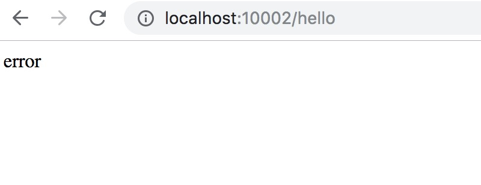
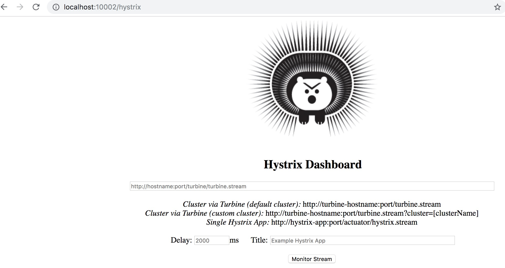
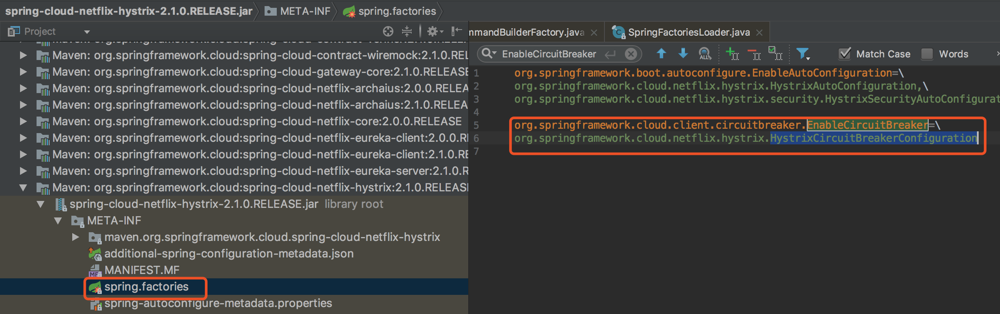

### 话不多说前言

- 避免单个服务失败导致关联服务耗尽线程。
- 思想：用快速失败替代排队
- 熔断后x秒恢复半开状态，如果有成功恢复，否则继续熔断
```
比如：订单系统请求库存系统，结果一个请求过去，因为各种原因，网络超时，在规定几秒内没反应，或者服务本身就挂了，这时候更多的请求来了，不断的请求库存服务，不断的创建线程，因为没有返回，也就资源没有释放，

这也导致了系统资源被耗尽，你的服务奔溃了，这订单系统好好的，你访问了一个可能有问题的库存系统，结果导致你的订单系统也奔溃了，你再继续调用更多的依赖服务，可会会导致更多的系统奔溃，这时候Hystrix可以实现快速失败，

如果它在一段时间内侦测到许多类似的错误，会强迫其以后的多个调用快速失败，不再访问远程服务器，从而防止应用程序不断地尝试执行可能会失败的操作进而导致资源耗尽。这时候Hystrix进行FallBack操作来服务降级
```

### 书中自有黄金屋

- 客官,你看完了前言,如此优秀
- 【支付宝扫码】奖励自己一下，后面还有。


### 依赖

```xml
<!--熔断-->
    <dependency>
      <groupId>org.springframework.cloud</groupId>
      <artifactId>spring-cloud-starter-hystrix</artifactId>
      <version>RELEASE</version>
    </dependency>
    <dependency>
      <groupId>org.springframework.cloud</groupId>
      <artifactId>spring-cloud-starter-hystrix-dashboard</artifactId>
      <version>RELEASE</version>
    </dependency>
```

### demo
- 启动类

```java
@SpringBootApplication
@EnableCircuitBreaker
@EnableHystrix
@EnableHystrixDashboard
public class HystrixApplication {
  public static void main(String[] args) {
    SpringApplication.run(HystrixApplication.class, args);
  }
}

```

- 服务出错后，调用fallback

```java
@Controller
@ResponseBody
public class HystrixController {

  //请求熔断注解，当服务出现问题时候会执行fallbackMetho属性的名为helloFallBack的方法
  @HystrixCommand(fallbackMethod = "helloFallBack")
  @RequestMapping(value = "/hello")
  public String helloService() throws Exception, InterruptedException {
    if (new Random().nextBoolean() == true) {
      throw new Exception();
    }
    return "ok";
  }

  public String helloFallBack() {
    return "error";
  }
}
```

- 测试

```
浏览器输入 http://localhost:10002/hello

正常情况返回 ok
因为代码中会随机触发错误，出错立刻返回 error
```




- 添加Dashboard监控到系统

```
启动类的注解

@EnableHystrix
@EnableHystrixDashboard

浏览器输入
http://localhost:10002/hystrix/
```



### 进阶：熔断源码解析

- 入口，启动类注解 @EnableCircuitBreaker

```java
@Target(ElementType.TYPE)
@Retention(RetentionPolicy.RUNTIME)
@Documented
@Inherited
@Import(EnableCircuitBreakerImportSelector.class)
public @interface EnableCircuitBreaker {

}
```

这里import了 EnableCircuitBreakerImportSelector 这个selector，

看下 EnableCircuitBreakerImportSelector 中的其他逻辑

- EnableCircuitBreakerImportSelector
```java
@Order(Ordered.LOWEST_PRECEDENCE - 100)
public class EnableCircuitBreakerImportSelector extends
		SpringFactoryImportSelector<EnableCircuitBreaker> {

	@Override
	protected boolean isEnabled() {
		return getEnvironment().getProperty(
				"spring.cloud.circuit.breaker.enabled", Boolean.class, Boolean.TRUE);
	}

}
```

Order值越小，加载优先级越高
EnableCircuitBreakerImportSelector继承SpringFactoryImportSelector会自动加载EnableCircuitBreaker

然而在源码中能看到，EnableCircuitBreaker这个类又关联HystrixCircuitBreakerConfiguration



顺藤摸瓜，看到其中定义了一个切面（Aspect）
```java
  @Bean
  public HystrixCommandAspect hystrixCommandAspect() {
    return new HystrixCommandAspect();
  }
```

其对应的处理pointcut为HystrixCommand，所以被 @HystrixCommand注解的地方都会执行下面的函数
```java
    @Around("hystrixCommandAnnotationPointcut() || hystrixCollapserAnnotationPointcut()")
    public Object methodsAnnotatedWithHystrixCommand(final ProceedingJoinPoint joinPoint) throws Throwable {
        Method method = getMethodFromTarget(joinPoint);
        Validate.notNull(method, "failed to get method from joinPoint: %s", joinPoint);
        if (method.isAnnotationPresent(HystrixCommand.class) && method.isAnnotationPresent(HystrixCollapser.class)) {
            throw new IllegalStateException("method cannot be annotated with HystrixCommand and HystrixCollapser " +
                    "annotations at the same time");
        }
        MetaHolderFactory metaHolderFactory = META_HOLDER_FACTORY_MAP.get(HystrixPointcutType.of(method));
        MetaHolder metaHolder = metaHolderFactory.create(joinPoint);
        HystrixInvokable invokable = HystrixCommandFactory.getInstance().create(metaHolder);
        ExecutionType executionType = metaHolder.isCollapserAnnotationPresent() ?
                metaHolder.getCollapserExecutionType() : metaHolder.getExecutionType();

        Object result;
        try {
            if (!metaHolder.isObservable()) {
                result = CommandExecutor.execute(invokable, executionType, metaHolder);
            } else {
                result = executeObservable(invokable, executionType, metaHolder);
            }
        } catch (HystrixBadRequestException e) {
            throw e.getCause();
        } catch (HystrixRuntimeException e) {
            throw hystrixRuntimeExceptionToThrowable(metaHolder, e);
        }
        return result;
    }
```

其中核心代码是execute这一段，跳转进去看到
```java
public static Object execute(HystrixInvokable invokable, ExecutionType executionType, MetaHolder metaHolder) throws RuntimeException {
        Validate.notNull(invokable);
        Validate.notNull(metaHolder);

        switch (executionType) {
            case SYNCHRONOUS: {
                return castToExecutable(invokable, executionType).execute();
            }
            case ASYNCHRONOUS: {
                HystrixExecutable executable = castToExecutable(invokable, executionType);
                if (metaHolder.hasFallbackMethodCommand()
                        && ExecutionType.ASYNCHRONOUS == metaHolder.getFallbackExecutionType()) {
                    return new FutureDecorator(executable.queue());
                }
                return executable.queue();
            }
            case OBSERVABLE: {
                HystrixObservable observable = castToObservable(invokable);
                return ObservableExecutionMode.EAGER == metaHolder.getObservableExecutionMode() ? observable.observe() : observable.toObservable();
            }
            default:
                throw new RuntimeException("unsupported execution type: " + executionType);
        }
    }
```

这个方法的主干代码，就是根据executionType的不同类型执行不同逻辑
对应关系如下：
```
SYNCHRONOUS --> HystrixExecutable.execute()
ASYNCHRONOUS --> HystrixExecutable.queue()
OBSERVABLE --> HystrixObservable.observe() 或 HystrixObservable.toObservable()

```

简单来说，这个注解，就是把一个java方法，转化成HystrixCommand
其中用到了"面向切面编程AOP"大家可以自行再去学习

这一篇就到这里了, [本文示例源码github](https://github.com/WayneZeng/springcloud-demo)
喜欢请打赏5毛买包辣条


