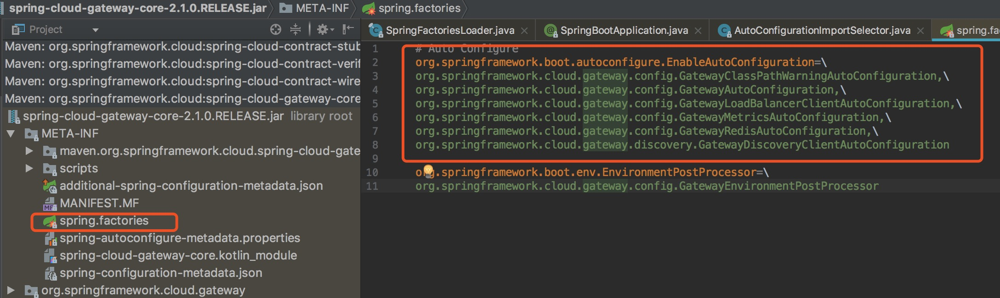

### 话不多说前言
* 一般出于安全考虑不会直接让客户端直接请求后端服务，所以加一个网关层（gateway），
```
就像一个大门，
客户端要拿着钥匙（鉴权），
限定人数一次次通过大门（限流和整流）
进入到指定后端服务（路由），
如果屋内有不能见人的事情，可能要立刻关门哄客（熔断）。
```
* 网关主要涉及的功能也就是鉴权，路由，限流，熔断等。

### 书中自有黄金屋

- 客官,你看完了前言,如此优秀
- 【支付宝扫码】奖励自己一下，后面还有。


### 网关常用方案zuul

- 依赖如下

```java
<dependency>
    <groupId>org.springframework.cloud</groupId>
    <artifactId>spring-cloud-starter-zuul</artifactId>
</dependency>

```
- 配置文件 

```
# 直接路由
zuul.routes.baidu.path=/baidu/**
zuul.routes.baidu.url=http://www.baidu.com

# url重定向
# 相当于访问/index/** 重定向到/index2
zuul.routes.index.path=/index/**
zuul.routes.index.url=forward:/index2

#跳转微服务对应的serviceId，配合服务发现使用
zuul.routes.user.path=/user/**
zuul.routes.user.serviceId=user-server
```

- 启动类

```java
@SpringBootApplication
@EnableZuulProxy
public class GatewayServiceZuulApplication {

    public static void main(String[] args) {
        SpringApplication.run(GatewayServiceZuulApplication.class, args);
    }
}

```
注意添加注解EnableZuulProxy


### 高级功能
- 前面的功能只是简单的路由转发，用nginx，简单controller都可以实现。
- zuul的精华是四种过滤器：
    *   Pre，在路由之前被调用，用于身份验证
    *   routing，路由到微服务
    *   post， 路由到微服务后执行，用于统计信息
    *   error，出错之后执行
- 还可以自定义过滤器
- 其他应用：认证，压测。
    

```
注意：外部流量都经过gateway，所以gateway的高可用非常重要，一般部署一个zuul集群，通过注册中心管理。
```

### 其他网关方案：Spring Cloud Gateway
1 可以替代zuul的另外一种方案，比zuul 1.x的系列的性能和功能整体要好。
2 zuul 2.x也不错，不过没有集成到springcloud框架中，据说是因为更新等太久，springcloud就没有选择zuul 2.x


```
注意：Spring Cloud Finchley版本中，即使你引入了spring-cloud-starter-netflix-zuul，也不是2.0版本的zuul
```

依赖如下：

```
<dependency>
      <groupId>org.springframework.cloud</groupId>
      <artifactId>spring-cloud-starter-gateway</artifactId>
    </dependency>

    <dependency>
      <groupId>org.springframework.cloud</groupId>
      <artifactId>spring-cloud-starter-netflix-hystrix</artifactId>
    </dependency>
    
    <dependency>
      <groupId>org.springframework.cloud</groupId>
      <artifactId>spring-cloud-starter-contract-stub-runner</artifactId>
      <exclusions>
        <exclusion>
          <artifactId>spring-boot-starter-web</artifactId>
          <groupId>org.springframework.boot</groupId>
        </exclusion>
      </exclusions>
    </dependency>

    <dependency>
      <groupId>org.springframework.boot</groupId>
      <artifactId>spring-boot-starter-webflux</artifactId>
    </dependency>
```

使用示例：

```java
@SpringBootApplication
public class GatewayApplication {

  private static final Logger logger = LoggerFactory.getLogger(GatewayApplication.class);

  @Bean
  public RouterFunction<ServerResponse> routerFunction() {
    return RouterFunctions.route(
        RequestPredicates.path("/helloworld"),
        request -> ServerResponse.ok().body(BodyInserters.fromObject("helloworld")));
  }

  @Bean
  public RouteLocator customRouteLocator(RouteLocatorBuilder builder) {
    // 添加header头，便于鉴权
    return builder.routes()
        .route(r -> r.path("/header")
            .filters(f ->
                f.addResponseHeader("X-AnotherHeader", "another-header"))
            .uri("http://www.baidu.com")
        )
        .build();
  }

  public static void main(String[] args) {
    SpringApplication.run(GatewayApplication.class, args);
  }
}

```

#### 测试
```
启动后
1 浏览器输入：http://locahost:10001/helloworld 路由到对应输出

2 浏览器输入：http://locahost:10001/header，会自动添加header头然后转发到www.baidu.com，常用于鉴权。
```

### 源码解析：为什么通过@Bean加载 RouteLocator即可生成一个网关路由
* 新手直接看gateway的源码容易内伤，这里我们就选择一个简单的 RouteLocator 代码看看。

* 先看启动注解 @SpringBootApplication，跳转进入其中用到了 @EnableAutoConfiguration

* EnableAutoConfiguration的原理这里不详述，其作用如下
```
@EnableAutoConfiguration作用：从classpath中搜索所有的META-INF/spring.factories配置文件，然后将其中key为org.springframework.boot.autoconfigure.EnableAutoConfiguration的value加载到spring容器中
```

* 看下gateway模块自动引入的包如下



```
自动注入的类如下：
GatewayClassPathWarningAutoConfiguration - 检查项目是否正确导入 webflux
GatewayAutoConfiguration - 核心配置
GatewayLoadBalancerClientAutoConfiguration - 负载均衡客户端
GatewayMetricsAutoConfiguration - 网关指标自动配置类
GatewayRedisAutoConfiguration - 限流相关
GatewayDiscoveryClientAutoConfiguration - 服务发现客户端

```

* 看下GatewayAutoConfiguration的注解

```java
@AutoConfigureBefore({HttpHandlerAutoConfiguration.class, WebFluxAutoConfiguration.class})
@AutoConfigureAfter({GatewayLoadBalancerClientAutoConfiguration.class, GatewayClassPathWarningAutoConfiguration.class})
```

  - 知道加载顺 （GatewayLoadBalancerClientAutoConfiguration，GatewayClassPathWarningAutoConfiguration） 先于 （GatewayAutoConfiguration）
  
  - 其中 GatewayClassPathWarningAutoConfiguration
```
看下其中的告警信息，可以知道，如果引入了spring-boot-starter-web的依赖，是会报错的

因为gateway是基于spring-webflux开发的，他依赖的DispatcherHandler
和starter-web里的DispatcherServlet冲突
```

* GateWayAutoConfiguration是核心配置，其中加载了 RoutePredicateHandlerMapping

```java
 @Bean
  public RoutePredicateHandlerMapping routePredicateHandlerMapping(FilteringWebHandler webHandler, RouteLocator routeLocator, GlobalCorsProperties globalCorsProperties, Environment environment) {
    return new RoutePredicateHandlerMapping(webHandler, routeLocator, globalCorsProperties, environment);
  }
```

* RoutePredicateHandlerMapping

```
RoutePredicateHandlerMapping是处理获取路由的hanlder。Route
存储在RouteLocator，读到这里，可以知道，自定义RouteLocator，通过@Bean加载即可
生成gateway可用的路由配置，也就是demo中的例子
```

### gateway的源码还有很多值得学习的地方，敬请期待

这一篇就到这里了，还没有想好怎么把这么复杂的gateway简单讲出来，就不要打赏了

