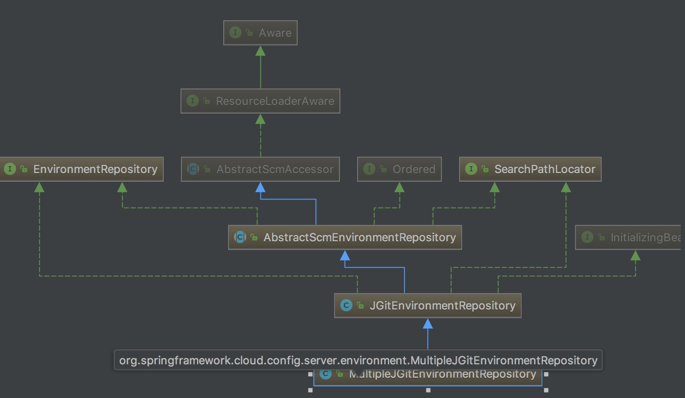

### 话不多说前言
- 本地的配置文件放到服务端统一管理，便于维护
- 部署需要服务端 和 客户端两个服务
- 服务器和git集成，便于追踪配置修改记录和执行回滚操作

### 书中自有黄金屋

- 客官,你看完了前言,如此优秀
- 【支付宝扫码】奖励自己一下，后面还有。


### 服务端部署
- 依赖

```
   <dependency>
      <groupId>org.springframework.cloud</groupId>
      <artifactId>spring-cloud-config-server</artifactId>
    </dependency>
```

- 配置

```
server.port=10003

spring.application.name=configserver

# github的相关配置
spring.cloud.config.server.git.uri=https://xxx
spring.cloud.config.server.git.search-paths=xxx
spring.cloud.config.server.git.username=xxx
spring.cloud.config.server.git.password=xxx
```

其中私人配置我用xxx代替了，大家替换成自己的配置即可

假设配置的search-paths下有个文件hello.properties，其中内容为

```
id=hello
```

- 测试访问
http://127.0.0.1:10003/master/hello.properties

url规则

```
ip:port/分支/文件名
```

### 客户端部署
- 依赖

```
<dependency>
    <groupId>org.springframework.cloud</groupId>
    <artifactId>spring-cloud-starter-config</artifactId>
</dependency>
```

- 启动类加注解

```java
@SpringBootApplication
@EnableDiscoveryClient
public class ConfigApplication {

  public static void main(String[] args) {
    SpringApplication.run(ConfigApplication.class, args);
  }
}
```

- 编写测试类controller

```java
@Controller
@ResponseBody
public class ConfigController {

  @Value("${id}")
  private String id;

  @RequestMapping(value = "/hello")
  public String helloService() throws Exception, InterruptedException {
    return "ok" + id;
  }

}
```

- 测试访问
浏览器访问： http://localhost:10004/hello

返回信息包含配置中心的配置。说明成功。


### 进阶

* 从启动类注解 @EnableConfigServer 跳转进入

```java
@Configuration
public class ConfigServerConfiguration {
	class Marker {}

	@Bean
	public Marker enableConfigServerMarker() {
		return new Marker();
	}
}
```

可以看到 这里并没有太多Bean的装备，Marker被ConfigServerAutoConfiguration引用

```java
@Configuration
@ConditionalOnBean(ConfigServerConfiguration.Marker.class)
@EnableConfigurationProperties(ConfigServerProperties.class)
@Import({ EnvironmentRepositoryConfiguration.class, CompositeConfiguration.class, ResourceRepositoryConfiguration.class,
		ConfigServerEncryptionConfiguration.class, ConfigServerMvcConfiguration.class })
public class ConfigServerAutoConfiguration {

}
```

* @ConditionalOnBean(ConfigServerConfiguration.Marker.class)表示当装配了ConfigServerConfiguration.Marker的实例时才会执行ConfigServerAutoConfiguration的处理。
包含EnvironmentRepositoryConfiguration类。

```java
@Configuration
@EnableConfigurationProperties({ SvnKitEnvironmentProperties.class,
      JdbcEnvironmentProperties.class, NativeEnvironmentProperties.class, VaultEnvironmentProperties.class })
@Import({ CompositeRepositoryConfiguration.class, JdbcRepositoryConfiguration.class, VaultRepositoryConfiguration.class,
      SvnRepositoryConfiguration.class, NativeRepositoryConfiguration.class, GitRepositoryConfiguration.class,
      DefaultRepositoryConfiguration.class })
public class EnvironmentRepositoryConfiguration {
}
```

这里引入了新的配置类，可以看到其支持的配置方式
  - svn
  - jdbc
  - git
  - native repository
  - 等等
  
以git为例

```java
@Configuration
@Profile("git")
class GitRepositoryConfiguration extends DefaultRepositoryConfiguration {
}
```

* 可以看到其继承的是默认配置项DefaultRepositoryConfiguration

```java
@Configuration
@ConditionalOnMissingBean(value = EnvironmentRepository.class, search = SearchStrategy.CURRENT)
class DefaultRepositoryConfiguration {
	@Autowired
	private ConfigurableEnvironment environment;

	@Autowired
	private ConfigServerProperties server;

	@Autowired(required = false)
	private TransportConfigCallback customTransportConfigCallback;

	@Bean
	public MultipleJGitEnvironmentRepository defaultEnvironmentRepository(
	        MultipleJGitEnvironmentRepositoryFactory gitEnvironmentRepositoryFactory,
			MultipleJGitEnvironmentProperties environmentProperties) throws Exception {
		return gitEnvironmentRepositoryFactory.build(environmentProperties);
	}
}
```

其中装配的MultipleJGitEnvironmentRepository
继承关系类图是



* 其中核心是实现了基类中的findOne方法，在MultipleJGitEnvironmentRepository的实现如下

```java
	@Override
	public Environment findOne(String application, String profile, String label) {
		for (PatternMatchingJGitEnvironmentRepository repository : this.repos.values()) {
			if (repository.matches(application, profile, label)) {
				for (JGitEnvironmentRepository candidate : getRepositories(repository,
						application, profile, label)) {
					try {
						if (label == null) {
							label = candidate.getDefaultLabel();
						}
						Environment source = candidate.findOne(application, profile,
								label);
						if (source != null) {
							return source;
						}
					}
					catch (Exception e) {
						if (logger.isDebugEnabled()) {
							this.logger.debug(
									"Cannot load configuration from " + candidate.getUri()
											+ ", cause: (" + e.getClass().getSimpleName()
											+ ") " + e.getMessage(),
									e);
						}
						continue;
					}
				}
			}
		}
		JGitEnvironmentRepository candidate = getRepository(this, application, profile,
				label);
		if (label == null) {
			label = candidate.getDefaultLabel();
		}
		if (candidate == this) {
			return super.findOne(application, profile, label);
		}
		return candidate.findOne(application, profile, label);
	}
```

* 而返回的 Environment，就是我们客户端获取的配置数据的结构。

这一篇就到这里了， [本文示例源码github](https://github.com/WayneZeng/springcloud-demo)

喜欢请打赏5毛买包狗粮


